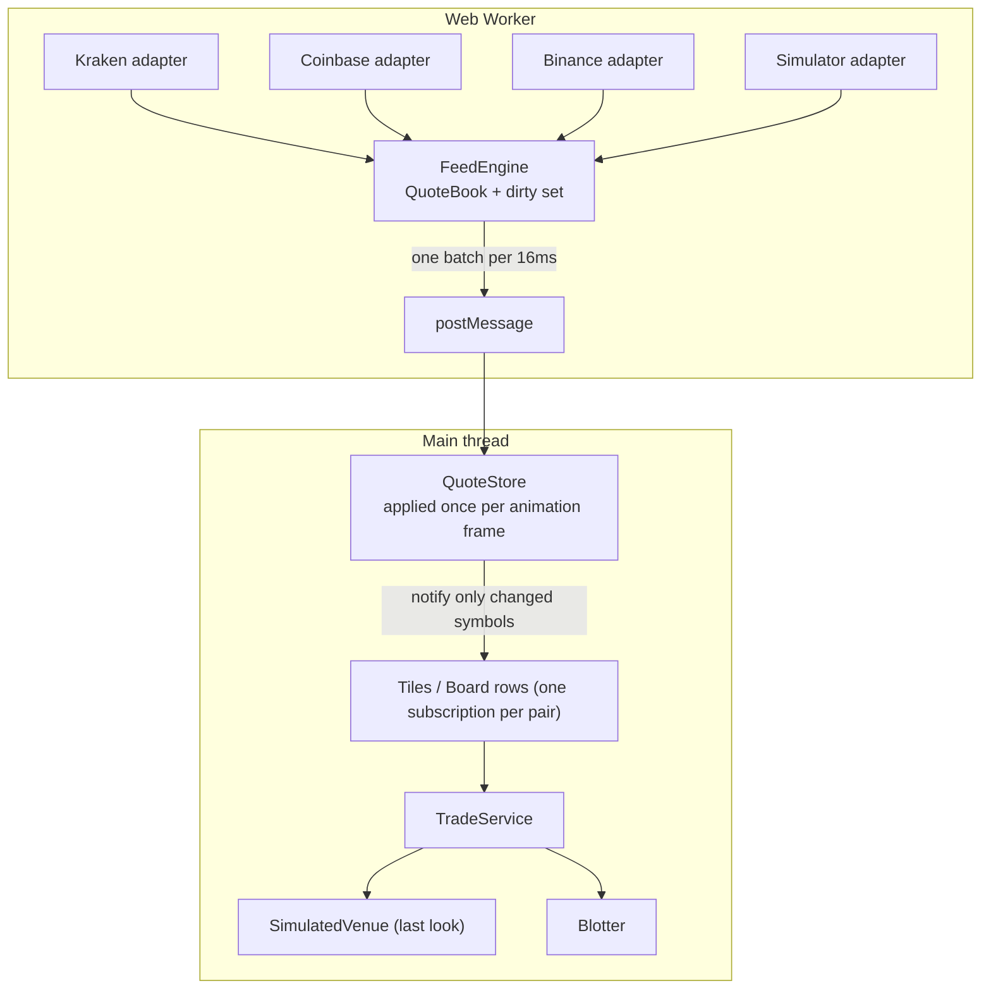

# Crypto price ticker

A client-side price ticker that aggregates live bid/ask prices from **Kraken, Coinbase and Binance** over WebSockets. It shows the best price for each pair and which venue is showing it, and lets you place dummy trades against it. There are two layouts, FX-style **Tiles** and a dense **Board** with one docked trade ticket, and a **stress mode** that pushes 60 simulated pairs at thousands of updates per second through the same pipeline.

## Run it

```bash
npm install
npm run dev      # http://localhost:5173
npm test         # unit tests
npm run lint
npm run build    # type-check + production build
```

URL flags (also linked in the header):

| URL | What it does |
|---|---|
| `/` | Live prices from the three exchanges |
| `?mode=stress&rate=3000` | 60 simulated pairs from three fake venues at 3,000 updates/s |
| `&count=5` | Fewer simulated pairs (each one updates faster) |
| `&conflate=off` | Send every update straight to the UI, for before/after comparison |
| `&worker=off` | Run the feed on the main thread instead of a Web Worker |

## Architecture



| Folder | Responsibility |
|---|---|
| `src/core` | Plain, serialisable domain types and instrument precision |
| `src/providers` | One adapter per source, a shared `WebSocketAdapter` base, `ReconnectingSocket`, and the registry |
| `src/feed` | Aggregation (`QuoteBook`), the conflating `FeedEngine`, the worker, its message protocol, and `FeedClient` |
| `src/store` | `QuoteStore` (per-frame, per-symbol), `ValueStore`, `MidHistory`, React hooks |
| `src/trading` | `TradeService`, the `ExecutionVenue` interface, `SimulatedVenue` |
| `src/app` | Composition root (`createServices`) |
| `src/ui` | React components. They read stores and never touch sockets |

## How I approached it

I built it naively first and added each optimisation once I could measure why it was needed: one exchange rendering straight from a WebSocket, then an adapter interface for three exchanges, aggregation, state outside React, conflation, and finally the Web Worker.

## Key decisions

**One adapter interface.** Every source implements `ProviderAdapter` (`start`, `stop`) and reports through a `QuoteSink`. `WebSocketAdapter` handles connecting, subscribing, JSON parsing and symbol mapping once; each exchange supplies only its URL, symbol naming, subscribe message and a pure `parse()` that is unit-tested against messages captured from DevTools. Adding a provider is one class plus one line in `providers/registry.ts`.

**Canonical symbols at the border.** Kraken says `BTC/USD`, Coinbase `BTC-USD`, Binance `BTCUSDT`. Adapters translate, so nothing else in the app knows exchange naming.

**Reconnection.** `ReconnectingSocket` retries with exponential backoff and jitter, resubscribes on every open, and has an idle watchdog. Exchanges send heartbeats, so silence means a dead connection even without a close event. A disconnected provider is removed from the aggregate immediately, and stale quotes expire, so the UI never shows a price nobody is quoting.

**Aggregation.** Best bid is the highest bid across venues and best ask the lowest ask, each tagged with its venue. `aggregate()` is a pure function kept separate from the stateful `QuoteBook`, so the pricing rule is a few lines with one-line tests.

**State outside React.** Quotes live in `QuoteStore`. Each row or tile subscribes to its own pair through `useSyncExternalStore`, so a BTC tick re-renders only the BTC price, never the page. You can verify this with React DevTools' "highlight updates".

**Conflation in two stages.** In the engine, a tick only marks its pair dirty; every 16ms each dirty pair is aggregated once and sent as one batch. In the store, batches are applied once per animation frame, latest price wins. Output is bounded by pairs × frame rate however fast the network is. "Latest wins" is right for prices, but would be wrong for trades or order events.

**Web Worker.** Sockets, `JSON.parse` and aggregation run in a worker, so network bursts can't take frame time from rendering. Threads only exchange copied plain data, which is why adapters are described as data (`{ kind: 'kraken' }`) and built by the registry inside the worker. Conflation keeps the worker cheap: at most about 60 small messages per second cross the boundary instead of one per tick.

**Two views over one store.** Tiles follow the FX dealer layout from the brief: each pair is its own ticket. The Board is my take for many instruments: one row per pair with a 60-second sparkline, and trading moves to a single docked ticket. That separates watching from trading (one amount field instead of 60) and fits far more pairs on screen. Colour is reserved for meaning: green and red only for price movement, and the ticket buttons stay neutral until hovered. Only the digits that actually changed flash. Arrow keys move through the board.

**Dummy trading with last look.** Clicking Buy or Sell takes the price and venue on screen. `SimulatedVenue` waits 150–450ms, re-checks that venue's current price, and rejects if it moved against you by more than 10 bps. Amounts accept `2.5`, `10k` or `1.5m`, in either currency. `ExecutionVenue` is an interface, so a real gateway would replace one constructor call.

## Assumptions and findings

- **USDT is treated as USD, as the brief allows.** In live mode I measured a consistent ~2 basis point gap: Binance's USDT prices sat about 0.02% above the USD venues across every pair. That's why the aggregate is often "Crossed" (best bid on Binance above best ask elsewhere). It's the USDT/USD rate, not a timing effect.
- **Crossed markets are shown, not hidden.** Across venues they're usually timing or currency artefacts, and trading both sides can leave you with one leg filled and the other rejected.
- **Coinbase's public `ticker` channel only updates on trades,** so its best bid/ask can lag Kraken (`event_trigger: bbo`) and Binance (`bookTicker`).

## With more time

- Convert USDT quotes to USD using a live USDT/USD rate.
- Load each exchange's symbol list and tick sizes at startup, and derive display precision from the real tick size.
- Switch modes and simulator rate at runtime instead of by URL.
- Persist the blotter locally (in production the server is the record of trades).
- Virtualise the board for hundreds of pairs.
- End-to-end tests with Playwright against a mocked WebSocket server, plus a frame-time regression test in stress mode.
- Pre-commit hooks (lint-staged) in addition to CI.
